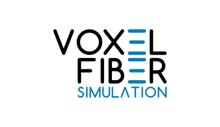

<!-- README.md is generated from README.Rmd. Please edit that file -->

# voxelfiber 

Eduardo L. T. Conceição

## Overview

voxelfiber is a morphological simulator for porous materials that can be
modeled as planar random networks. Typical examples include paper sheets
and electrospun webs. Fibers are represented by a chain of voxels in a
3D discrete spatial grid. This has the added benefit of allowing the
direct use of methods developed for the 3D imaging field. The key
property of fiber flexibility is implemented via the
[mechanism](https://doi.org/10.1103/PhysRevLett.73.3475) originally
proposed for the [KCL](http://kcl.fi)-PAKKA simulator.

It requires MATLAB R2018b and above. It also requires the Statistics and
Machine Learning Toolbox.

## Installation

For the time being voxelfiber will not be packaged in a toolbox. Simply
download the source code and documentation to a convenient folder.

Run the demo by typing `formingdemo` in the MATLAB command window.

## Getting started

The function `forming()` is used to construct the virtual material
object and method functions are applied to the object to compute
morphology features:

  - porosity, by function `porosity()`
  - sheet thickness, by function `thickness()`
  - relative bonded area, by function `rba()`
  - number of contacts between fibers, by function `numcrossings()`
  - number of fibers covering a point, by function `coverage()`

3D visualization is done using function `vis_sheet()`. This can take
several minutes for large sheets with high basis weight. Help
documentation is available in the form of live scripts found under the
folder *help*.

## More resources

A basic description of voxelfiber can be found in [Coding a Simulation
Model of the 3D Structure of
Paper](https://doi.org/10.1007/978-3-642-12712-0_27). Please cite this
paper if you use voxelfiber.

-----

#### License

voxelfiber is licensed under the [GNU General Public License
version 3](https://opensource.org/licenses/GPL-3.0). No user support
provided.
